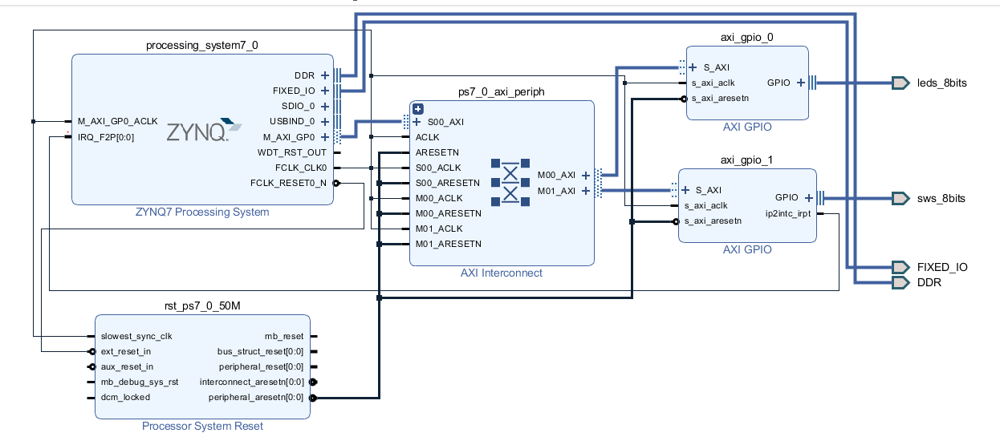

# 📘 SoC_HW2：使用 FPGA GPIO 產生中斷之實作

本專案為 ZYNQ SoC 平台上 HW2 作業，目標為透過 **FPGA GPIO 與外部開關 (SW)** 作為中斷來源，驅動中斷機制並由 Processing System (PS) 處理，實作 GPIO 控制與 LED 顯示。內容包含硬體設計（Vivado）、軟體撰寫（Vitis）、中斷控制與 LED 顯示功能。

---

## ✅ 題目要求對應

| 項目                     | 本專案說明                                 |
|--------------------------|--------------------------------------------|
| 使用 FPGA 硬體觸發中斷   | 使用 AXI GPIO 模組（接收 SW）              |
| 使用外部 SW 作為輸入來源 | 開關連接至 `axi_gpio_1`，觸發中斷          |
| 使用中斷控制器 (GIC)     | `XScuGic` 控制中斷，處理 IRQ 註冊與清除    |
| 驅動設計與 SDK 撰寫     | 使用 Vitis 撰寫中斷驅動與 LED 控制邏輯     |

---

## 📐 系統架構 (Vivado Block Design)

- `axi_gpio_1`：
  - 設為 **All Inputs**
  - 開啟 **Interrupt Output**
  - 接收開關 (`sws_8bits`) 並輸出 `ip2intc_irpt` 中斷訊號

- `axi_gpio_0`：
  - 設為 **All Outputs**
  - 連接 LED (`leds_8bits`)

- 中斷訊號 `ip2intc_irpt` 連接至 `processing_system7_0.IRQ_F2P[0]`

- 系統搭配 `ps7_0_axi_periph` 與 `rst_ps7_0_50M` 負責 AXI 匯流排與重置信號控制

---

## 🧾 檔案內容

```plaintext
├── design_1.vhd         # 匯出之 HDL 頂層（由 Block Design 自動產生）
├── helloworld.c         # 中斷處理程式與 LED 控制邏輯
├── SOC_HW2.PNG          # 系統 Block Design 圖
├── README.md            # 專案說明文件（本檔）
```

---

## 🧠 程式邏輯 (helloworld.c)

### 🔁 主流程：

- 初始化平台與 GPIO 設定
- 持續以 0.5 秒速度改變 LED 數值 (`LED_num++`)
- 顯示 LED 狀態並透過 UART 印出目前值

### ⚡ 中斷流程：

當開關觸發中斷時：

1. `axi_gpio_1` 的 `ip2intc_irpt` 啟動 IRQ
2. PS 中的 `GIC` 呼叫 `Intr_Handler()` 函式
3. 中斷服務函式中：
   - 延遲防彈跳
   - 關閉與清除中斷旗標
   - 清除 LED 顯示並等待 2 秒
   - 再次啟用中斷
   - 中斷次數加一並顯示於 UART

---

## ⚙️ 軟體設計細節

### 初始化設定

```c
XGpio_Initialize(&LED, LED_ID);
XGpio_SetDataDirection(&LED, 1, 0);  // CH1 為輸出

XGpio_Initialize(&BTN, BTN_ID);
XGpio_SetDataDirection(&BTN, 1, 1);  // CH1 為輸入
```

### 中斷註冊與啟用

```c
XScuGic_Connect(&INTCInst, INTC_GPIO_ID, (Xil_ExceptionHandler)Intr_Handler, &BTN);
XScuGic_Enable(&INTCInst, INTC_GPIO_ID);

XGpio_InterruptGlobalEnable(&BTN);
XGpio_InterruptEnable(&BTN, BTN_INT);
```

---

## 🧪 測試方法

1. 將設計下載至 ZedBoard
2. 將開關 (SW) 接至 AXI GPIO 輸入
3. 啟動程式後，觀察：
   - LED 以每 0.5 秒遞增
   - 按下任一開關會觸發中斷
   - 中斷時 LED 關閉 2 秒，再繼續跑
   - UART 印出中斷次數與 LED 值

---

## 📸 Block Design 圖



---

## 📚 補充說明

- 所有中斷透過 `IRQ_F2P` 接腳從 PL 傳入 PS
- `XGpio` 來自 Xilinx 提供的硬體抽象層（HAL）
- `XScuGic` 控制通用中斷控制器（GIC）
- 使用 `Xil_ExceptionRegisterHandler()` 註冊中斷機制
- 可從 `xparameters.h` 取得 IRQ 對應 ID

---
## 影片
https://youtube.com/shorts/j865eOVRy94


